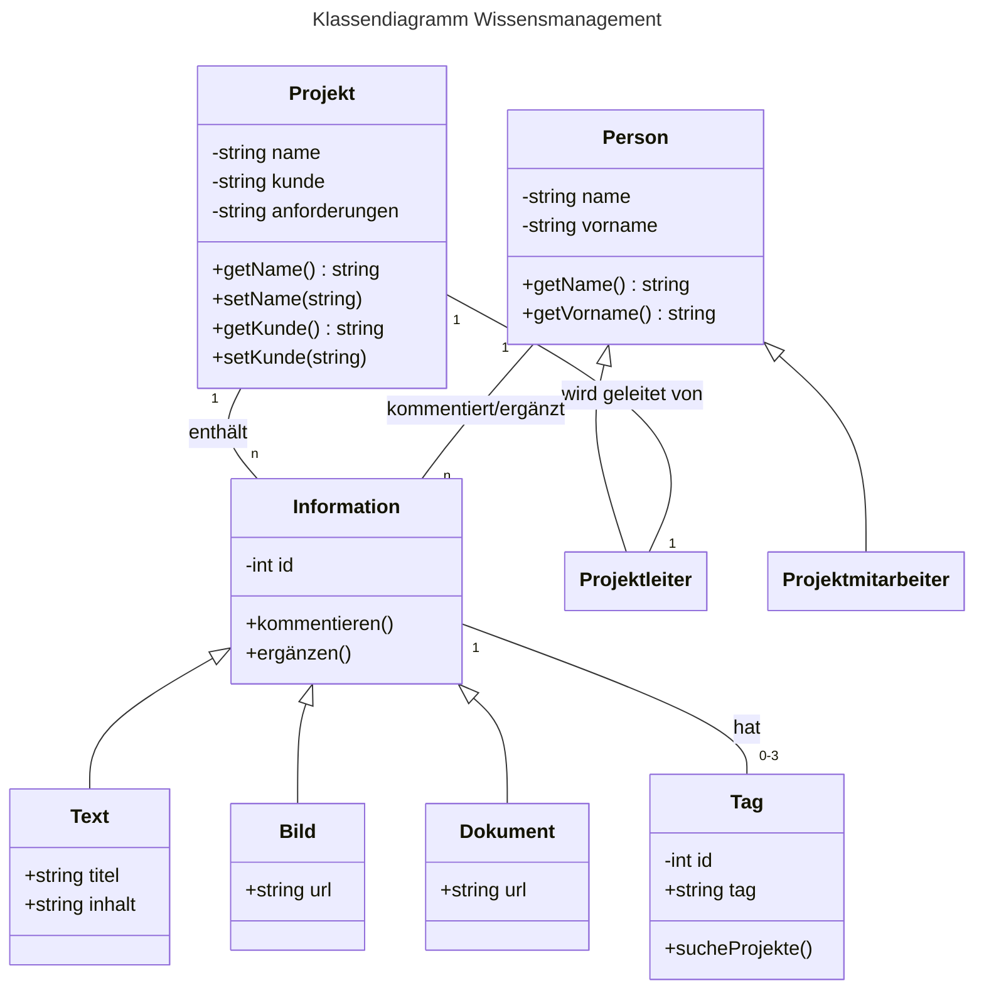

```mermaid
---
title: Klassendiagramm Wissensmanagement
config:
    class:
        hideEmptyMembersBox: true
---
classDiagram
    class Person {
        -string name
        -string vorname
        +getName() string
        +getVorname() string
    }
    class Projekt {
        -string name
        -string kunde
        -string anforderungen
        +getName() string
        +setName(string)
        +getKunde() string
        +setKunde(string)
    }
    class Information {
        -int id
        +kommentieren()
        +ergänzen()
    }
    class Text {
        +string titel
        +string inhalt
    }
    class Bild {
        +string url
    }
    class Dokument {
        +string url
    }
    class Tag {
        -int id
        +string tag
        +sucheProjekte()
    }
    Person <|-- Projektleiter
    Person <|-- Projektmitarbeiter
    Information <|-- Text
    Information <|-- Bild
    Information <|-- Dokument
    Information "1" -- "0-3" Tag : hat
    Projekt "1" -- "n" Information : enthält
    Projekt "1" -- "1" Projektleiter : wird geleitet von
    Person "1" -- "n" Information : kommentiert/ergänzt
```
