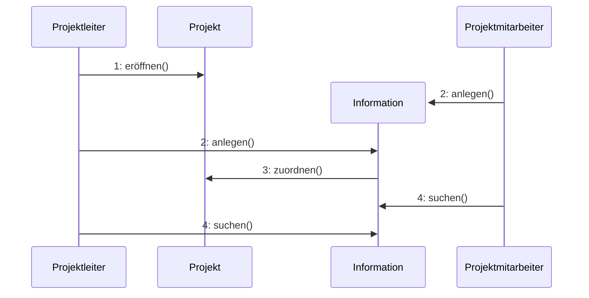

```mermaid
sequenceDiagram
    Projektleiter->>Projekt: 1: eröffnen()
    create participant Information
    Projektmitarbeiter->>Information: 2: anlegen()
    Projektleiter->>Information: 2: anlegen()
    Information->>Projekt: 3: zuordnen()
    Projektmitarbeiter->>Information: 4: suchen()
    Projektleiter->>Information: 4: suchen()

```
